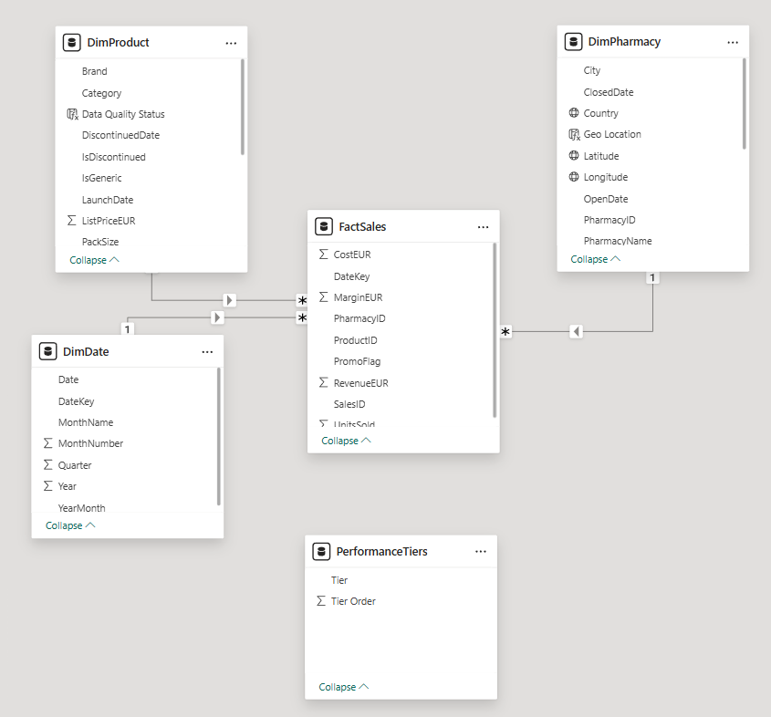
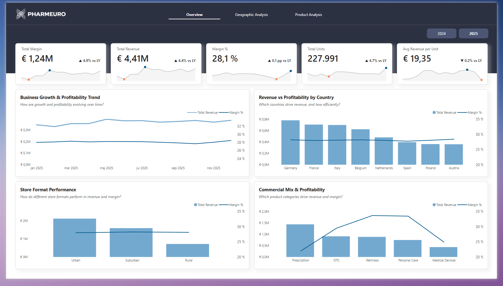
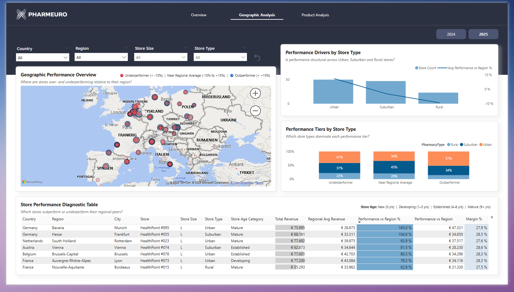
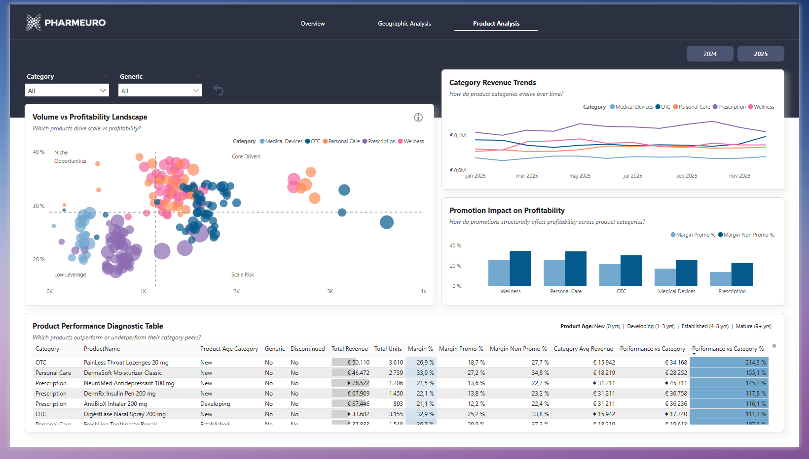

# Pharmacy Sales & Profitability Analysis

## Overview

### Company Context
Pharmeuro, established in 2009, is a European B2B distributor supplying pharmaceutical, healthcare and wellness products to a network of **120 pharmacies across multiple European markets**. The company manages a broad portfolio of prescription drugs, home medical devices, over-the-counter treatments, and wellness items distributed to pharmacies operating in geographically diverse regions.

Over time, Pharmeuro has accumulated significant volumes of transactional data covering product sales, pharmacy purchasing behavior, geographic distribution patterns, and promotional activity. While this data supports operational workflows, much of its analytic potential has remained underutilized for performance monitoring and commercial decision-making.

### Business Objective

The primary objective of this project was to transform transactional sales and distribution data into a structured analytical model capable of supporting **commercial performance analysis across B2B partners, products, and geographic markets**.

The resulting Power BI report provides a unified view of commercial performance across geography and product portfolios, enabling stakeholders to identify performance drivers, structural inefficiencies, and growth opportunities.

### Analytical Scope

Insights and recommendations are provided across the following key analytical areas:

- **Geographic Performance Analysis:** Evaluation of how revenue and profitability vary across countries and regions, identifying geographic growth opportunities and clusters of underperformance within the pharmacy network.
- **Customer-Level Performance Diagnostics:** Comparative analysis of pharmacy performance relative to regional benchmarks, highlighting performance variation across segments and identifying commercial outliers.
- **Product Portfolio Analysis:** Assessment of how distributed products balance volume and profitability across categories, identifying core drivers, niche opportunities, and structurally weak product segments.
- **Promotion and Profitability Impact:** Investigation of how promotional activity affects margin structure across product categories, revealing where volume growth may come at the cost of profitability.

## Data Structure

Pharmeuro’s dataset follows a **star schema design optimized for analytical performance and scalability**, with a central fact table supported by several dimension tables.

The data model includes the following tables:

- **FactSales (62,139 rows):** Contains daily transactional records of product sales distributed to pharmacies during 2024-2025. Each record captures units sold, revenue, cost, margin and promotional status.
- **DimProduct (220 rows):** Stores product-level attributes, including category, brand, pricing structure, product lifecycle dates, and generic classification.
- **DimPharmacy (120 rows):** Contains information about pharmacy partners within the distribution network, including geographical information, pharmacy type classification, and lifecycle dates.
- **DimDate (731 rows):** Provides a structured calendar dimension supporting time-based analysis across daily, monthly, and yearly periods.

In addition to the core tables, a small supporting table was created:

- **PerformanceTiers:** A helper table used to classify pharmacy performance into standardized performance tiers for segmentation analysis.

### Data Model Overview

Below is the relational model used to support the analysis:

Prior to beginning the analysis, **data profiling and quality validation** were conducted in Power Query to familiarize with data distributions, identify anomalies, and ensure consistency across datasets.

## Executive Summary

Between 2024 and 2025, Pharmeuro achieved **moderate growth across its distribution network**, with total revenue increasing by **4.4%**, supported by a **4.7% rise in units distributed**. Profitability remained stable throughout the period, with margin improving by **4.9%** and margin percentage holding steady at approximately **28%**, indicating controlled expansion without erosion of efficiency.

Revenue concentration remains strongest in core markets such as **Germany, France and Italy**, while secondary markets show potential for expansion. Product category performance indicates that **prescription products drive most of the revenue**, while **wellness products deliver higher relative profitability**. Portfolio growth was supported by stable performance among core prescription products and continued profitability from wellness-oriented categories. Across pharmacy segments, urban pharmacies generate the largest share of revenue, while rural locations contribute less volume but maintain comparable profitability levels.

Below is the Overview page from the Power BI dashboard:

## Insights Deep Dive

### Geographic Performance Insights

- **The active pharmacy network expanded from 113 locations in 2024 to 120 in 2025**, with most new additions occurring in urban markets. This indicates continued geographic expansion focused on higher-density areas where demand potential is strongest, reinforcing an urban-first expansion pattern across the distribution network.
- **Urban pharmacies strengthened their performance advantage**, improving from **+2.3% to +7.3% above regional benchmarks**, while suburban and rural pharmacies also improved but remained below regional averages. This confirms a structural performance gap linked to location type.
- **Suburban pharmacies showed the largest recovery**, improving from **-9.8% to -3.2%**, suggesting stabilization in mid-density markets and improved operational consistency.
- **Outperforming pharmacies remain concentrated in urban locations**, reinforcing metropolitan areas as the primary drivers of commercial success across the distribution network.
- **Geographic performance patterns remain stable across core Western European markets**, particularly Germany, Belgium, the Netherlands, and France, while secondary markets display greater variability, indicating potential opportunities for targeted support or expansion strategies.
- **Operational maturity remains a key performance factor**, with mature pharmacies consistently appearing among top performers, while newer pharmacies are more frequently represented among underperformers during early-stage ramp-up.

### Product Portfolio & Promotion Insights

-**Prescription products remained the primary revenue driver across both 2024 and 2025**, consistently generating the largest monthly contribution despite structurally lower margins. This confirms their role as the operational backbone of the distribution portfolio, where volume stability outweighs margin expansion potential.
- **Wellness and Personal Care products delivered the highest relative margins**, maintaining strong profitability despite lower total volume, reinforcing their importance as margin-supporting categories.
- **Product demand growth between 2024 and 2025 was broadly distributed across categories**, with visible increases in several high-volume products positioned in the “Core Drivers” segment of the portfolio landscape.
- **Particularly within the Medical Devices category, several low-volume products remain concentrated in the “Low leverage” quadrant**, indicating structurally limited demand patterns that may require reassessing portfolio inclusion or applying targeted promotional support.
- **Promotional activity consistently reduced margin percentages across all categories**, with the largest margin gap observed in Wellness and Personal Care, highlighting the trade-off between sales volume growth and profitability preservation.
- **Emerging products positioned in the “Niche Opportunities” quadrant show strong profitability despite lower volume**, suggesting targeted growth opportunities through focused promotional or distribution strategies.

## Recommendations

Based on the uncovered insights, the following recommendations are proposed to guide further investigation and commercial planning:

- **Strengthen focus on high-performing urban markets within core regions while stabilizing underperforming suburban and rural regions.** Urban pharmacies consistently outperform regional benchmarks, while suburban and rural locations remain below average despite year-over-year improvements. Targeted operational support, customer engagement initiatives, or revised distribution strategies may help reduce persistent regional performance gaps.
- **Investigate persistent underperformance clusters at pharmacy level to identify structural causes.** Performance variation across pharmacies suggests that some locations consistently lag behind regional peers. Collaborating with regional sales and operations teams to review ordering patterns, service coverage, and local market conditions may uncover opportunities for targeted improvement.
- **Protect and optimize the core prescription portfolio by limiting broad, untargeted promotional activity.** Prescription products generate the largest share of revenue but operate with structurally lower margins. Continued focus on efficient distribution, pricing discipline, and supply optimization will help sustain revenue stability without compromising profitability.
- **Monitor promotional strategies to ensure volume growth does not erode long-term profitability.** Promotional discounts consistently reduce margins across all categories, with the largest margin impacts observed in Prescription products. Future promotional planning should prioritize targeted, category-specific campaigns that balance revenue growth with margin preservation.
- **Expand focus on high-margin categories such as Wellness and Personal Care by prioritizing their visibility within distributor ordering channels.** These categories consistently deliver stronger margin performance relative to others, suggesting opportunities to highlight them in catalogs and evaluate complementary product bundling opportunities.
- **Reassess low-impact Medical Devices products concentrated in the Low Leverage quadrant.** Most Medical Devices products demonstrate low volume and modest profitability across both years. Portfolio reviews should evaluate whether these products serve critical niche demand or require repositioning within the portfolio, bundling strategies, or potential rationalization.
- **Continue monitoring newly introduced products to ensure successful integration into the portfolio.** The presence of newly launched products across both years confirms ongoing portfolio renewal. Regular performance reviews during early lifecycle stages will help to identify products with strong growth potential as well as those requiring adjustments.

## Tools Used

- Power BI
- Power Query

## Perspective

This project was developed from the perspective of a **Senior Data Analyst within the central commercial analytics team**, with the objective of transforming raw operational data into structured analytical insight to support **strategic decision-making on product positioning, geographic focus, and promotional effectiveness**.

## Data Source

The dataset used in this project originates from the January-February 2026 DataDNA Challenge “Pharmacy Sales & Profitability Analytics”.

The data was provided as a single Excel workbook containing six sheets:

- FactSales
- DimDate
- DimPharmacy
- DimProduct
- Data Dictionary
- README

Prior to beginning data profiling and quality validation, the sheets were separated into individual Excel files.

### Get the Dataset

- [Onyx Data Challenge](https://datadna.onyxdata.co.uk/challenges/january-february-2026-datadna-pharmacy-sales-profitability-analytics-challenge/)
- [Zoomcharts](https://zoomcharts.com/en/microsoft-power-bi-custom-visuals/challenges/onyx-data-january-february-2026) (dataset available for download)
